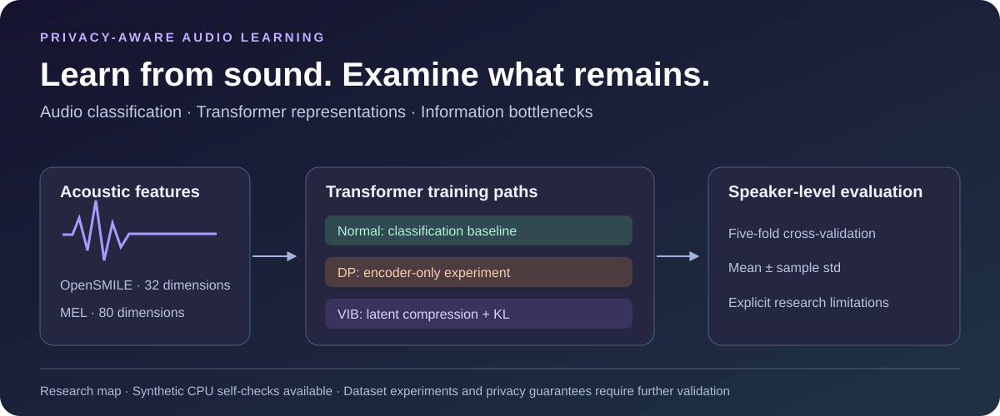

# 隐私感知音频学习 · Privacy-Aware Audio Learning

**基于 Transformer、差分隐私实验与变分信息瓶颈的音频分类研究。**

[English](README.md) · [运行指南](experiment/README.md) · [使用示例](experiment/examples.md) · [研究状态](docs/research-status.md)



原名 `DPIB-MI`。当前重点是 **Normal / DP / VIB**：比较声学特征、信息压缩与隐私相关训练方法如何影响音频分类。Whisper LoRA 和对抗训练相关文件属于保留的历史代码。

## 先跑一个不需要音频的例子

在仓库根目录创建虚拟环境并安装 `requirements.txt`，然后运行：

```bash
python experiment/train_unified.py --help
python experiment/train_unified.py --smoke-test --feature_type opensmile --mode normal
python experiment/train_unified.py --smoke-test --feature_type mel --mode vib
```

自检在 CPU 上使用随机生成的特征，验证模型前向、反向、参数更新和评估路径，不读取音频、不下载预训练模型。它验证安装与模型执行，不代表真实数据集效果或隐私保证。

## 研究内容与状态

- **特征**：OpenSMILE 声学特征、MEL 频谱特征；当前模型输入分别为 32、80 维。
- **模型**：Transformer 编码器、分类头、VIB 高斯隐变量与 KL 正则项。
- **评估**：按说话人划分的五折交叉验证代码，汇总输出均值与样本标准差。
- **DP 实验**：当前仅对编码器接入 Opacus，分类器仍单独更新，且训练器未使用返回的私有数据加载器；尚不能宣称整个模型具有差分隐私保证。
- **真实训练准备**：原始数据与权重未提供，OpenSMILE 数据加载模块也未提交。MEL 标签回退和标准化流程仍需改进。

本次验证覆盖 Normal/VIB × OpenSMILE/MEL 四条合成特征模型路径，没有重跑真实五折实验。下一步优先解决数据加载、标签来源与训练折标准化，再形成可信的“效果—隐私预算”对比。
